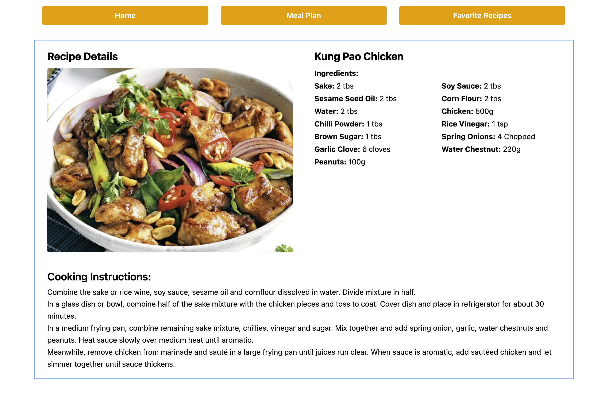
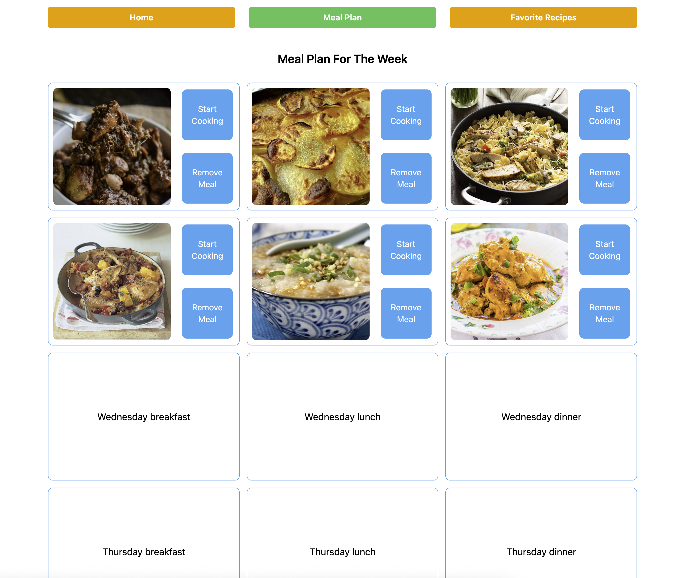

# Recipe Planner

## Overview

A small React app for planning weekly meals. Search recipes by ingredient via [TheMealDB](https://www.themealdb.com/api.php), view details, add them to a weekly plan, and save favorites.

## Stack

- Vite + React
- React Router
- Tailwind CSS

## Project Structure

├── eslint.config.js
├── index.html
├── package-lock.json
├── package.json
├── public/
│ └── vite.svg
├── README.md
├── src/
│ ├── App.css
│ ├── App.jsx
│ ├── assets/react.svg
│ ├── components/
│ │ ├── NavBar.jsx
│ │ └── RecipeCard.jsx
│ ├── index.css
│ ├── layout/AppLayout.jsx
│ ├── main.jsx
│ └── pages/
│ ├── ErrorPage.jsx
│ ├── Favorites.jsx
│ ├── Home.jsx
│ ├── MealPlan.jsx
│ ├── NotFound.jsx
│ └── RecipeDetails.jsx
└── vite.config.js

## How It Works

- **Home**: Enter an ingredient; results are fetched from TheMealDB and rendered as cards.  
  

- **Recipe Detail**: Shows image, ingredients, and cooking instructions for a selected recipe.  
  

- **Meal Plan**: 7×3 grid (Mon–Sun × breakfast/lunch/dinner). Add/remove recipes per slot.  
  

- **Favorites**: Save/remove recipes for quick access.  
  

## UI / Responsiveness

- Grids adjust: 1 column (mobile) → 2 columns (≥640px) → 3 columns (≥930px) using Tailwind arbitrary breakpoint.
- Layouts are capped with `max-w-screen-lg` and centered with `mx-auto`.
- Navbar stacks vertically on very small screens (`max-[511px]:flex-col`).

## API

- Ingredient search uses TheMealDB filter endpoint (via loader in `AppLayout.jsx`).
- Recipe details are fetched by id (loader used in `RecipeDetails.jsx`).

## Getting Started

```bash
# Clone
git clone https://github.com/yourusername/recipe-planner.git
cd recipe-planner

# Install
npm install

# Develop
npm run dev
```
